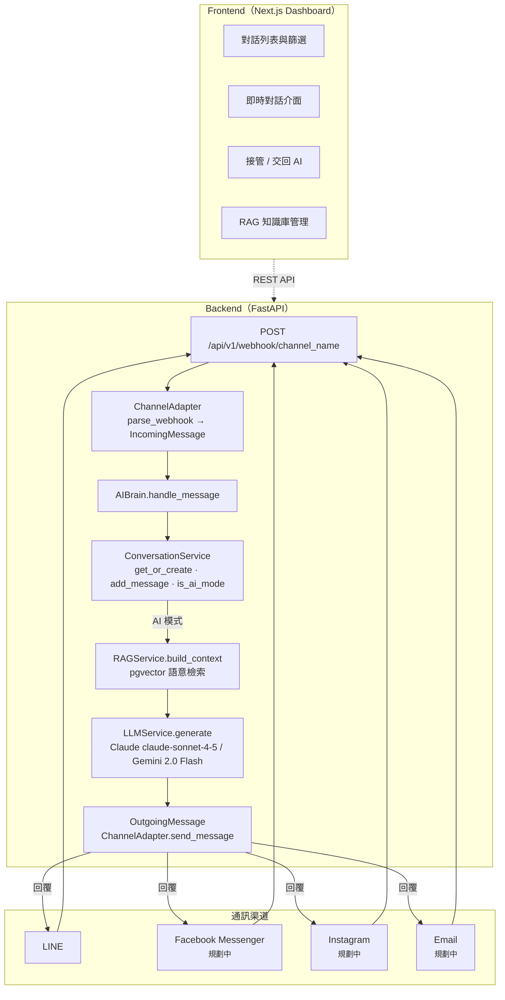
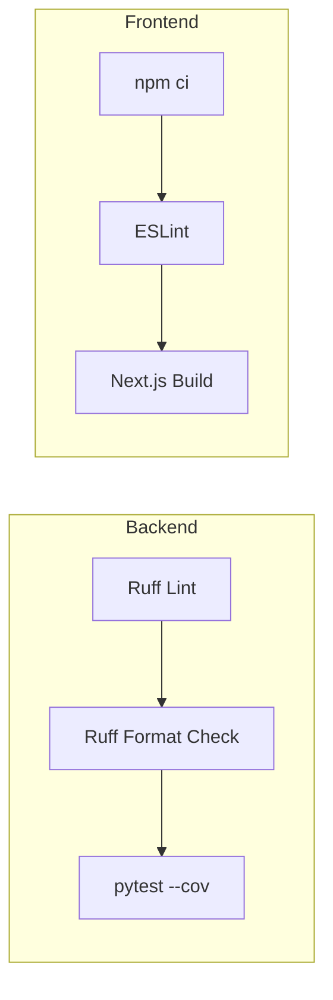

# BnB Platform

> 民宿多渠道 AI 智能客服平台 — Multi-channel AI-powered Customer Service Platform for BnB

BnB Platform 是一套專為民宿業者設計的智能客服系統，透過 Channel Adapter 架構整合多種通訊渠道（LINE、未來支援 Facebook Messenger / Instagram / Email），結合 RAG 知識檢索與大型語言模型，自動回覆房客常見問題。管理員可透過 Dashboard 即時監控對話、接管回覆、管理知識庫。

## 系統架構



### 核心流程

1. **Webhook 接收** — 各渠道訊息統一進入 `POST /api/v1/webhook/{channel_name}`
2. **訊息解析** — `ChannelAdapter` 將渠道原始格式轉換為 `IncomingMessage`
3. **對話管理** — `ConversationService` 建立或取得對話，記錄訊息歷史
4. **AI 模式判斷** — 若為 AI 模式，進入 RAG + LLM 流程
5. **知識檢索** — `RAGService` 透過 pgvector 語意搜尋相關民宿資料
6. **回覆生成** — `LLMService` 使用 Claude claude-sonnet-4-5 或 Gemini 2.0 Flash 產生回覆
7. **訊息發送** — 透過 `ChannelAdapter.send_message()` 回覆至對應渠道

### Dashboard 功能

- 查看所有對話（支援 AI / Human 模式篩選）
- 接管對話（takeover）— 切換至 Human 模式，AI 停止自動回覆
- 交回 AI（release）— 恢復 AI 模式
- Human 模式下管理員可直接發訊息給客人
- RAG 知識庫管理 — 上傳 / 刪除 TXT、PDF、DOCX 文件

## 技術棧

| 層級 | 技術 |
|------|------|
| **後端** | Python 3.12、FastAPI 0.115、SQLAlchemy 2 (async)、Pydantic v2、Alembic |
| **資料庫** | PostgreSQL 16 + pgvector（向量語意搜尋） |
| **LLM** | Anthropic Claude claude-sonnet-4-5、Google Gemini 2.0 Flash |
| **前端** | Next.js 16、React 19、TypeScript 5、Tailwind CSS v4、shadcn/ui、Zustand |
| **前端 BaaS** | Supabase（Auth + Realtime） |
| **CI** | GitHub Actions — backend (ruff + pytest --cov) + frontend (eslint + build) 並行 |
| **CD** | Vercel（前端）+ GHCR Docker Image（後端）；push to main 自動觸發 |
| **建置工具** | hatchling（後端）、npm（前端）、Docker Compose（本地開發） |

## 專案結構

```
bnb-platform/
├── .github/workflows/
│   ├── ci.yml                  # CI：lint + test（push / PR to main）
│   └── cd.yml                  # CD：deploy（push to main）
├── frontend/                   # Next.js 前端
│   ├── src/
│   │   ├── app/                # App Router 頁面
│   │   │   ├── conversations/  # 對話管理頁面
│   │   │   ├── dashboard/      # 儀表板
│   │   │   ├── documents/      # 知識庫管理
│   │   │   └── settings/       # 設定
│   │   ├── components/         # UI 元件（shadcn/ui）
│   │   ├── lib/                # API client、types、utils
│   │   └── stores/             # Zustand 狀態管理
│   └── package.json
└── services/
    └── api/                    # FastAPI 後端
        ├── app/
        │   ├── api/            # REST API endpoints
        │   ├── channels/       # Channel Adapters（LINE、registry）
        │   │   ├── base.py     # ChannelAdapter 抽象基底類別
        │   │   ├── line/       # LINE Channel Adapter
        │   │   └── registry.py # Adapter 註冊機制
        │   ├── core/           # Config、database 連線
        │   ├── models/         # SQLAlchemy ORM models
        │   ├── schemas/        # Pydantic request/response schemas
        │   └── services/       # 業務邏輯
        │       ├── ai_brain.py         # AI 訊息處理核心
        │       ├── conversation.py     # 對話管理
        │       ├── llm.py              # LLM 呼叫（Claude / Gemini）
        │       ├── rag.py              # RAG 知識檢索
        │       └── google_integration.py
        ├── alembic/            # 資料庫 migration
        ├── tests/              # pytest 測試
        ├── Dockerfile
        ├── docker-compose.yml  # 本地開發用
        └── pyproject.toml
```

## 快速開始

### 前置需求

- [Docker](https://www.docker.com/) 與 Docker Compose
- [Node.js](https://nodejs.org/) 20+（前端開發）
- [Git](https://git-scm.com/)

### 1. Clone 專案

```bash
git clone https://github.com/nccu95208069/bnb-platform.git
cd bnb-platform
```

### 2. 啟動後端

```bash
# 建立環境變數檔
cp services/api/.env.example services/api/.env
# 編輯 .env，填入必要的 API Keys
```

`services/api/.env` 需要設定以下變數：

| 變數 | 說明 |
|------|------|
| `DATABASE_URL` | PostgreSQL 連線字串（Docker Compose 預設已設定） |
| `LINE_CHANNEL_SECRET` | LINE Messaging API Channel Secret |
| `LINE_CHANNEL_ACCESS_TOKEN` | LINE Messaging API Channel Access Token |
| `ANTHROPIC_API_KEY` | Anthropic API Key（使用 Claude 時） |
| `GOOGLE_GEMINI_API_KEY` | Google Gemini API Key（使用 Gemini 時） |
| `OPENAI_API_KEY` | OpenAI API Key（Embedding 用） |

```bash
# 啟動後端服務（FastAPI + PostgreSQL）
cd services/api
docker-compose up
```

後端 API 預設運行於 `http://localhost:8000`。

### 3. 啟動前端

```bash
# 建立前端環境變數
cp frontend/.env.example frontend/.env.local
# 編輯 .env.local，填入 Supabase 設定
```

`frontend/.env.local` 需要設定：

| 變數 | 說明 |
|------|------|
| `NEXT_PUBLIC_SUPABASE_URL` | Supabase 專案 URL |
| `NEXT_PUBLIC_SUPABASE_ANON_KEY` | Supabase Anonymous Key |
| `NEXT_PUBLIC_API_URL` | 後端 API URL（預設 `http://localhost:8000`） |

```bash
cd frontend
npm install
npm run dev
```

前端預設運行於 `http://localhost:3000`。

## CI / CD

### CI（持續整合）

每次 push 或 PR 到 `main` 分支時自動觸發，backend 與 frontend 並行執行：



- **Backend**: `ruff check` + `ruff format --check` + `pytest --cov`
- **Frontend**: `eslint` + `next build`（含 TypeScript 型別檢查）
- Branch protection: `main` 分支要求 CI 全部通過

### CD（持續部署）

Push 到 `main` 分支時自動部署：

- **Frontend** → Vercel（需設定 `VERCEL_TOKEN`、`VERCEL_ORG_ID`、`VERCEL_PROJECT_ID`）
- **Backend** → 建置 Docker Image 並推送至 GitHub Container Registry（GHCR）

## 新增渠道

BnB Platform 採用 **Channel Adapter Pattern**，新增通訊渠道只需三步：

1. 在 `services/api/app/channels/` 下建立新目錄（如 `facebook/`）
2. 實作 `ChannelAdapter` 抽象介面（`parse_webhook`、`send_message`）
3. 在 `registry.py` 註冊新 Adapter

無需修改核心業務邏輯，AI Brain、RAG、LLM 等服務完全解耦。

## 未來規劃

- [ ] 新增 Facebook Messenger / Instagram / Email 渠道
- [ ] 多語言支援
- [ ] 完善 Supabase Auth 整合
- [ ] Google Calendar / Sheets 整合（訂房系統）

## 授權

Private Repository
